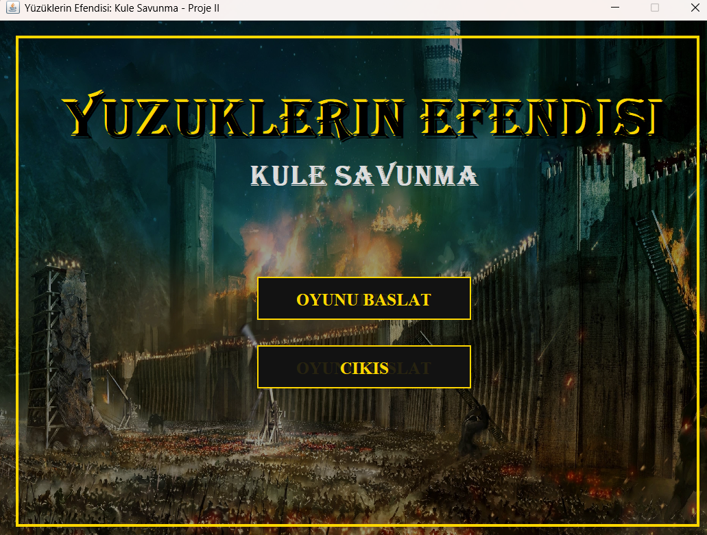
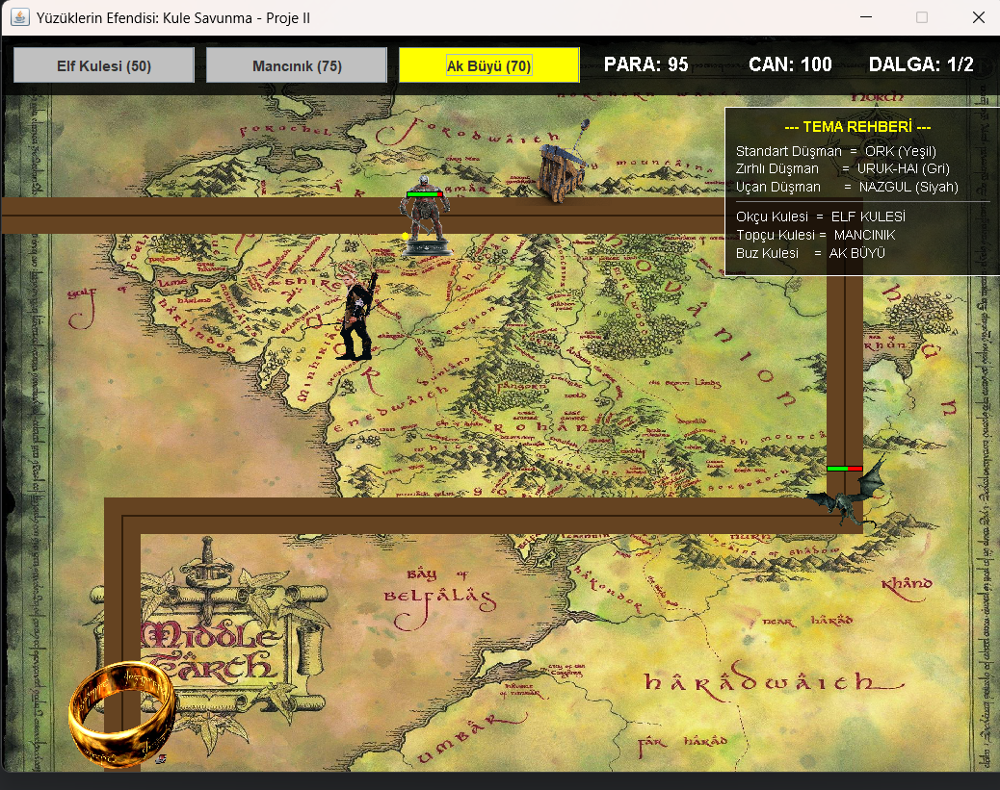
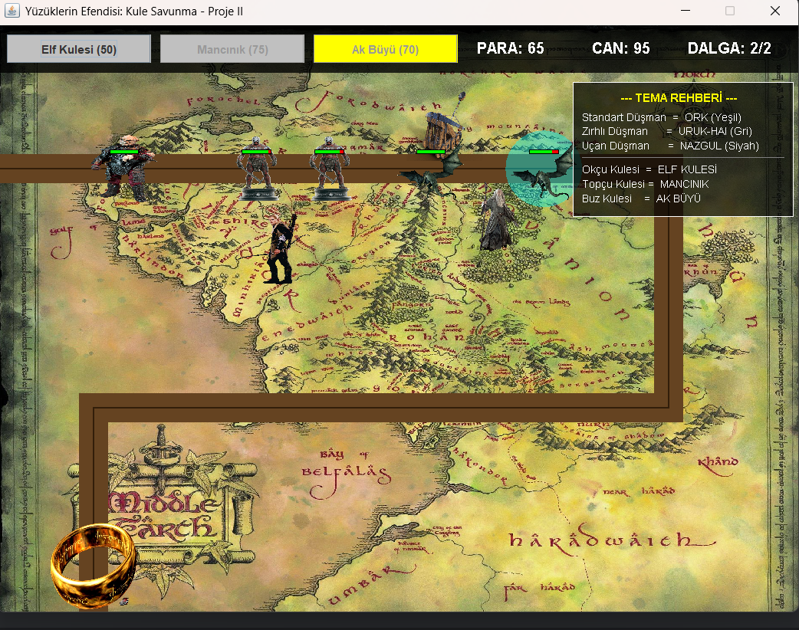

<div align="center">

# 🧙‍♂️ Yüzüklerin Efendisi: Kule Savunma
### _Lord of the Rings: Tower Defense_

**Nesneye Yönelik Programlama prensipleri ve olay güdümlü (event-driven) mimari ile Java Swing üzerinde geliştirilmiş, "Yüzüklerin Efendisi" temalı bir kule savunma simülasyonu.**


</div>

---

## 📖 Proje Hakkında

Bu proje, Kocaeli Üniversitesi Bilgisayar Mühendisliği **Programlama Laboratuvarı I** dersi kapsamında geliştirilmiştir. Amaç, **Kalıtım (Inheritance)**, **Soyutlama (Abstraction)**, **Kapsülleme (Encapsulation)** ve **Çok Biçimlilik (Polymorphism)** gibi temel NYP kavramlarını; gerçek zamanlı, etkileşimli bir oyun simülasyonu üzerinde pratiğe dökmektir.

Mordor orduları (Orklar, Uruk-Hai'ler, Nazgûller) Orta Dünya'yı işgale geliyor. Oyuncu olarak yol kenarlarına **Elf Kuleleri**, **Cüce Mancınıkları** ve **Ak Büyü Kuleleri** inşa ederek üssünü savunmak zorunda.

> 🎯 Tüm kritik oyun olayları (düşman girişi, hasar, ölüm, kule inşası) zaman damgasıyla `savunma_gunlugu.txt` dosyasına kaydedilir; bu sayede simülasyonun doğrulanabilirliği sağlanır.

---

## 🖼️ Ekran Görüntüleri

> 📌 _Aşağıdaki görselleri eklemek için projenize bir `screenshots/` klasörü açıp ekran görüntülerinizi koyun. (Bölüm sonundaki "Ekran görüntüsü ekleme" notuna bakın.)_

| Ana Menü | Dalga 1 | Dalga 2 |
|:---:|:---:|:---:|
|  |  |  |

---

## ✨ Özellikler

- 🏰 **3 farklı kule türü** — her biri kendine özgü saldırı mekaniğine sahip
- 👹 **3 farklı düşman türü** — standart, zırhlı ve uçan birimler
- 🌊 **Dalga (Wave) sistemi** — giderek zorlaşan 2 dalgalık senaryo
- 💰 **Ekonomi yönetimi** — düşman öldürerek para kazan, kule inşa etmek için harca
- ❄️ **Yavaşlatma efektleri** — Ak Büyü kuleleri düşmanları 3 saniye dondurur
- 🎯 **Akıllı hedefleme** — kuleler "üsse en yakın" düşmanı önceliklendirir
- 🩸 **Görsel geri bildirim** — can barları, yavaşlatma efektleri, sprite görseller
- 🎵 **Ses & atmosfer** — arka plan müziği ve özel "Algerian/Epik" yazı tipleri
- 📝 **Detaylı loglama** — tüm olaylar harici dosyaya zaman damgasıyla kaydedilir

---

## 🎮 Oyun Mekaniği

### 👹 Düşman Birimleri

| Tematik İsim | Tür | Can | Zırh | Hız | Ödül | Özellik |
|:---|:---|:---:|:---:|:---:|:---:|:---|
| **Ork** | Standart | 50 | 0 | Normal | 10 | Dengeli temel piyade |
| **Uruk-Hai** | Zırhlı | 75 | 100 | Yavaş | 20 | Gelen hasarın %50'sini absorbe eder |
| **Nazgûl** | Uçan | 50 | 0 | Hızlı | 15 | Mancınıklar tarafından hedeflenemez |

### 🏰 Savunma Kuleleri

| Tematik İsim | Tür | Hasar | Menzil | Fiyat | Özellik |
|:---|:---|:---:|:---:|:---:|:---|
| **Elf Kulesi** | Okçu | 20 | 150 | 50 | Seri atış; zırhlılara karşı hasarı düşük |
| **Cüce Mancınığı** | Topçu | 50 | 200 | 75 | Alan hasarı; sadece yer birimlerini vurur |
| **Ak Büyü Kulesi** | Buz | 10 | 150 | 70 | Düşmanları %50 yavaşlatır (3 sn) |

---

## 🧮 Matematiksel Modeller

**Zırh / Hasar Sönümleme Formülü** — zırh, hasarı doğrusal olmayan şekilde azaltır:

```
NetHasar = KuleHasarı × ( 1 − Zırh / (Zırh + 100) )
```

> Örn: 100 zırhlı bir Uruk-Hai gelen hasarın **%50'sini** absorbe ederken, 0 zırhlı bir Ork hasarın tamamını alır.

**Öklid Mesafe Bağıntısı** — kuleler menzil içindeki düşmanları bu formülle tespit eder:

```
Mesafe = √( (x₂ − x₁)² + (y₂ − y₁)² )
```

---

## 🏗️ Mimari ve NYP Prensipleri

Proje, kod tekrarını en aza indiren ve genişletilebilirliği artıran katmanlı bir NYP mimarisi üzerine kuruludur.

| Prensip | Uygulama |
|:---|:---|
| **Soyutlama** | `Dusman` ve `Kule` soyut sınıfları (abstract class), ortak alanları ve zorunlu davranışları tanımlar; doğrudan nesne üretilemez. |
| **Kalıtım** | `Ork`, `UrukHai`, `Nazgul` → `Dusman`'ı; `ElfKulesi`, `CuceMancinik`, `AkBuyuKulesi` → `Kule`'yi genişletir. |
| **Çok Biçimlilik** | `ciz()`, `hareketEt()` ve `hedefSecVeAtesEt()` metotları her alt sınıfta override edilir; tüm birimler tek bir `List<Dusman>` içinde yönetilir. |
| **Kapsülleme** | Alanlar `protected`/`private` tutulur, dışarıya yalnızca getter metotları açılır (örn. zırh hesabı `Dusman` içinde gizlenir). |

### 🔁 Simülasyon Döngüsü (Game Loop)

Motor `javax.swing.Timer` ile her **16 ms'de (~60 FPS)** çalışır ve her karede sırasıyla:

1. **Fiziksel güncelleme** — düşman koordinatları hız parametrelerine göre hesaplanır
2. **Mantıksal kontroller** — menzil tespiti, çarpışma (collision) testleri, ölen birimlerin silinmesi
3. **Render** — `repaint()` ile tüm nesneler ekrana çizilir

---

## 📂 Proje Yapısı

```
KouTowerDefense/
├── src/
│   ├── Main.java              # Giriş noktası, CardLayout pencere yönetimi
│   ├── MenuPaneli.java        # Ana menü ekranı (başlat / çıkış / sonuç)
│   ├── OyunPaneli.java        # Ana oyun döngüsü, çizim ve etkileşim
│   │
│   ├── Dusman.java            # [abstract] Düşman temel sınıfı
│   ├── Ork.java               # Standart düşman
│   ├── UrukHai.java           # Zırhlı düşman
│   ├── Nazgul.java            # Uçan düşman
│   │
│   ├── Kule.java              # [abstract] Kule temel sınıfı
│   ├── ElfKulesi.java         # Okçu kule
│   ├── CuceMancinik.java      # Topçu (alan hasarı) kule
│   ├── AkBuyuKulesi.java      # Buz (yavaşlatma) kule
│   │
│   ├── Mermi.java             # Mermi fiziği ve hasar uygulama
│   ├── Logger.java            # Olay loglama sistemi
│   └── Ses.java               # Arka plan müziği yönetimi
│
├── assets (proje kök dizini)
│   ├── *.png                  # ork, urukhai, nazgul, elf, mancinik, akbuyu, yuzuk
│   ├── harita.jpg, menu_bg.jpg
│   ├── muzik.wav
│   └── epik.ttf
│
└── savunma_gunlugu.txt        # Çalışma anında otomatik üretilir
```

---

## 🚀 Kurulum ve Çalıştırma

### Gereksinimler
- **JDK 8** veya üzeri (geliştirme sırasında Java kullanılmıştır)
- İsteğe bağlı: **IntelliJ IDEA** / Eclipse / NetBeans

### IntelliJ IDEA ile (önerilen)
1. Bu repoyu klonlayın:
   ```bash
   git clone https://github.com/KULLANICI_ADIN/KouTowerDefense.git
   ```
2. Projeyi IntelliJ'de açın.
3. `Main.java` dosyasını çalıştırın (`Shift + F10`).

### Terminal ile
```bash
# src klasöründeki tüm dosyaları derle
javac -d out src/*.java

# Çalıştır (çalışma dizini proje kökü olmalı ki görseller/ses bulunsun)
java -cp out Main
```

> ⚠️ **Önemli:** Görsel ve ses dosyaları (`ork.png`, `muzik.wav` vb.) göreli yolla yüklenir. Bu yüzden oyunu **proje kök dizininden** çalıştırın; aksi halde görseller/sesler yüklenmez.

---

## 🔮 Gelecek Çalışmalar

- [ ] **A\* (A-Star)** algoritması ile dinamik yol bulma
- [ ] Verilerin **SQL veritabanında** saklanması ve skor tablosu
- [ ] Daha fazla dalga, kule ve düşman çeşitliliği
- [ ] Kule yükseltme (upgrade) sistemi

---

## 👤 Yazar

**Burak Çakır**
Bilgisayar Mühendisliği Bölümü — Kocaeli Üniversitesi
📧 burakcakr43@gmail.com

> Bu proje bireysel bir çalışma olarak yürütülmüştür. Analiz, mimari tasarım, kodlama, görselleştirme, test ve raporlama aşamalarının tamamı yazar tarafından gerçekleştirilmiştir.

---

## 📜 Lisans

Bu proje [MIT Lisansı](LICENSE) altında lisanslanmıştır.
> This project is non-commercial and developed strictly for educational/academic purposes. All rights to the Lord of the Rings soundtrack and assets used in this project belong to their respective owners (Warner Bros. / Howard Shore).

> _"One does not simply walk into Mordor... but one can definitely defend against it."_ 🏔️
